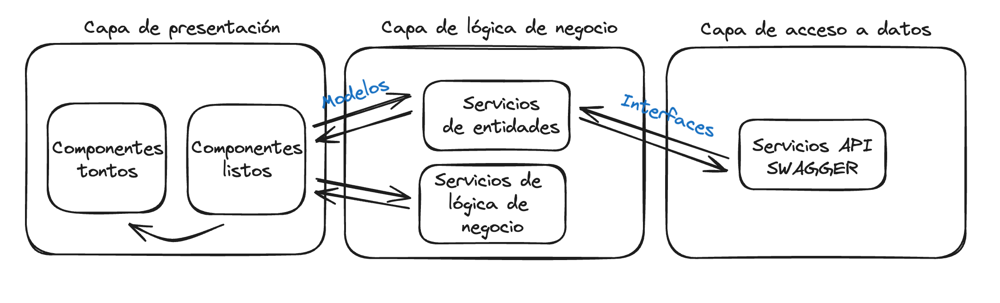

# Prueba de Codigo Avantio

Prueba tecnica realizada con la version dada por el proyecto original: Angular 14.13.0

### Cambios en la estructura

Se ha cambiado la estructura del proyecto para asemejarse al standard de Angular, siguiendo el siguiente patron:

````
[app]
├── app.component.[html|ts|scss|spec.ts]
├── app.module.ts
├── app-routing.module.ts
│
├── auth/
│   ├── auth.module.ts
│   └── ...
├── components/
│   ├── component1/
|   │   └── component1.component.[html|ts|scss|spec.ts]
│   ├── component2/
│   │   ├── component2.module.ts
│   │   └── component2.component.[html|ts|scss|spec.ts]
│   └── ...
├── guards/
│   ├── guard1.guard.[ts|spec.ts]
│   └── ...
├── services/
│   ├── service1.service.[ts|spec.ts]
│   └── ...
├── models/
│   ├── model1.ts
│   └── ...
├── pipes/
│   ├── pipe1.pipe.[ts|spec.ts]
│   └── ...
├── interceptors/
│   ├── interceptor1.interceptor.[ts|spec.ts]
│   └── ...
├── directives/
│    ├── directive1.directive.[ts|spec.ts]
│    └── ...
└── pages/
    ├── feature1/
    │   ├── feature1.module.ts
    │   ├── feature1-routing.module.ts
    │   ├── components/
    |   │   ├── feature1-component1/
    |   │   │   └── feature1-component1.component.[html|ts|scss|spec.ts]
    |   │   └── ...
    |   ├── services/
    |   │   ├── service1.service.[ts|spec.ts]
    |   │   └── ...
    |   └── ...
    ├── feature2/
    |   └── ...
    └── ...
````

### Cambios en el layout

Se ha cambiado el layout, de un servicio a una directiva, dejando el template html mas limpio y mas claro de la funcion del *ngLayout.
De esta forma, la escalabilidad pasa por importar la directiva y usarla, mas que inyectar el servicio y subscribirse a los observables pertinentes.

### Componentes nuevos
Se ha creado un sidebar component ademas de un notification-container con su componente notification para añadir notificaciones.

### Modelos
Se ha decantado por el uso de modelo, mas estricto que las interfaces, que ademas permite de una mejor forma la escalabilidad de la aplicacion,
delimitando las interfaces a los dto dados por el back en los servicios api (no se ha realizado el servicio api, ya que al ser algo pequeño se
ha obviado) pasados por el servicio app a un Modelo adecuado a la aplicacion, siguiendo el patron de arquitectura 3 capas de fronend.



### Author ✒️

Victor Hugo Polo Polo - https://github.com/Rhae91[Rhae91]
